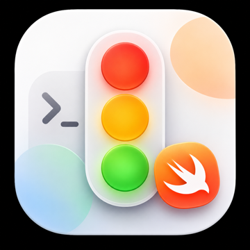

# Claude Traffic Light

A floating, frosted-glass traffic light widget for macOS that mirrors the live state of [Claude Code](https://claude.com/claude-code) on your desktop.

<p align="center">
  
</p>

<p align="center">
  <a href="https://taylorsimery.github.io/claude-traffic-light/">Website</a>
  ·
  <a href="https://github.com/TaylorSimery/claude-traffic-light/releases">Download</a>
  ·
  <a href="#getting-started">Getting started</a>
</p>

## Why

Claude Code runs in a terminal, so it is easy to lose track of what it is doing while you switch away. Claude Traffic Light reads its session log and shows a single, glanceable signal:

- **Yellow** — running. Claude is thinking, streaming, or executing a tool.
- **Green** — done. The last turn ended cleanly.
- **Red** — needs you. A tool is waiting for permission, the run errored, or the process died.

A small caption below the lights tells you which of those it is (`Working`, `Awaiting permission`, `Done`, …).

## Features

- Native SwiftUI widget. No Electron, no Python, no helper scripts.
- Frosted-glass panel that floats above other windows on every Space, including full-screen apps.
- Drag from anywhere on the panel. Right-click to quit.
- No menu bar item, no Dock icon — set as a `LSUIElement` background app.
- Reads `~/.claude/projects/**/*.jsonl` directly. No network, no telemetry.
- Universal binary, runs locally-signed on Apple Silicon and Intel from macOS 13.

## Getting started

### Download the prebuilt app

1. Grab `ClaudeTrafficLight.zip` from the [latest release](https://github.com/TaylorSimery/claude-traffic-light/releases).
2. Unzip and drop `ClaudeTrafficLight.app` into `/Applications`.
3. The app is ad-hoc signed. The first launch needs a right-click → **Open**, or run once:
   ```bash
   xattr -dr com.apple.quarantine /Applications/ClaudeTrafficLight.app
   ```
4. Launch. The widget appears in the upper-right corner of your main display.

### Build from source

Requires Xcode 15+ and macOS 13+.

```bash
git clone https://github.com/TaylorSimery/claude-traffic-light.git
cd claude-traffic-light
open ClaudeTrafficLight.xcodeproj
```

Hit **⌘R** to run, or build a Release `.app`:

```bash
xcodebuild -project ClaudeTrafficLight.xcodeproj \
           -scheme ClaudeTrafficLight \
           -configuration Release \
           -derivedDataPath build clean build
open build/Build/Products/Release/ClaudeTrafficLight.app
```

## How it detects status

Claude Code writes one JSON object per line to `~/.claude/projects/<project>/<session>.jsonl` while it works. The widget polls the newest of those files once a second and looks at:

- `pgrep claude` — is the CLI process still alive?
- The `stop_reason` and `content` of the last message.
- Whether the file has been modified in the last few seconds.

From those three signals it picks one of `running`, `success`, `error`, or `idle`. The full mapping lives in `ClaudeMonitor.swift` — it is short, single-file, and easy to adjust.

## Project layout

```
ClaudeTrafficLight/
  ClaudeTrafficLightApp.swift    App entry point + window setup
  FloatingPanel.swift            Borderless, always-on-top NSPanel
  TrafficLightView.swift         SwiftUI light + frosted glass
  ClaudeMonitor.swift            Polls Claude Code session logs
  Assets.xcassets/AppIcon        Multi-resolution app icon
  Info.plist                     LSUIElement, bundle metadata
ClaudeTrafficLight.xcodeproj/    Plain Xcode project, no SPM, no pods
docs/                            GitHub Pages landing page
```

## License

MIT. See [LICENSE](LICENSE).

## Credits

Built with SwiftUI. Icon and visual language designed for [Claude Code](https://claude.com/claude-code) by Anthropic.
