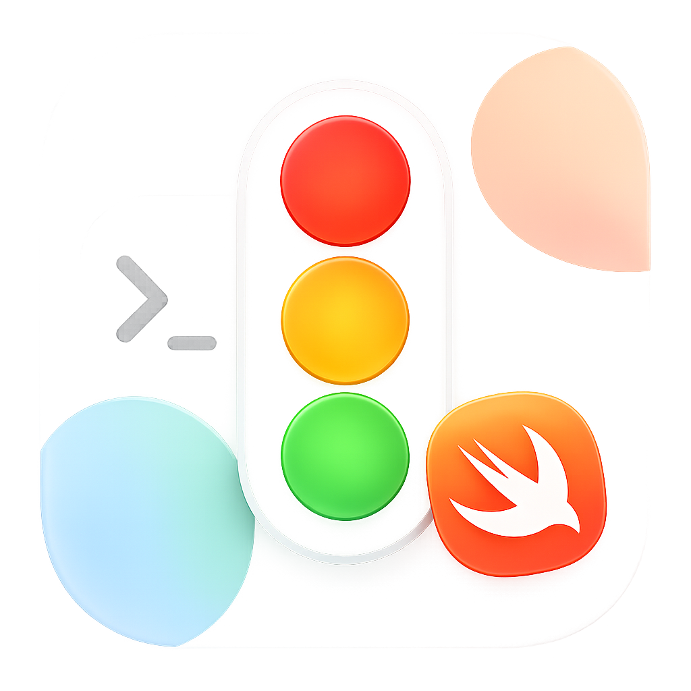
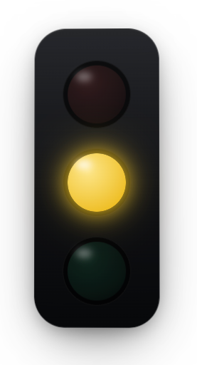

# Claude Traffic Light

> Tiny native macOS traffic-light widget for Claude Code.  
> 一个悬浮在桌面上的 Claude Code 状态灯。

[官网 / Website](https://taylorsimery.github.io/claude-traffic-light/) ·
[下载 / Releases](https://github.com/TaylorSimery/claude-traffic-light/releases) ·
[English README](README.en.md)

<p align="center">
  <a href="https://taylorsimery.github.io/claude-traffic-light/">
    
  </a>
</p>

<p align="center">
  
</p>

## 它解决什么问题

Claude Code 跑在终端里。你一切到浏览器、设计稿、Xcode 或全屏应用，就不知道它现在是还在忙、已经完成，还是卡在权限确认。

Claude Traffic Light 把这个状态变成一个小小的桌面信号灯：

- 黄灯: Claude 正在思考、流式输出或调用工具。
- 绿灯: 上一轮干净结束，可以回来看。
- 红灯: Claude Code 没运行、被中断、退出、报错，或正在等权限处理。

## 特性

- 原生 SwiftUI。
- 没有 Electron。
- 没有 Python。
- App 内没有辅助脚本。
- 无 Dock 图标、无菜单栏图标。
- `LSUIElement` 后台挂件形态。
- 悬浮在所有窗口和所有 Space 上，包括全屏应用。
- 任意位置拖动。
- 右键退出。
- 本机读取 `~/.claude/projects/**/*.jsonl`，不上传数据。

## 快速安装

1. 打开 [Releases](https://github.com/TaylorSimery/claude-traffic-light/releases)。
2. 下载 `ClaudeTrafficLight.zip`。
3. 解压后把 `ClaudeTrafficLight.app` 拖进 `/Applications`。
4. 第一次启动时，右键 App 选择 **Open**。
5. 打开终端运行 `claude`，提交一次 prompt。
6. 看桌面右上角的小信号灯。

如果 macOS 阻止打开，可以执行：

```sh
xattr -dr com.apple.quarantine /Applications/ClaudeTrafficLight.app
```

## 怎么用

- 红灯: 先确认 Claude Code 是否运行，或者回终端处理权限/错误。
- 黄灯: Claude 还在忙，继续做别的事情。
- 绿灯: 可以切回终端看结果。

如果 Claude Code 进程结束、被 Ctrl+C 中断、工具调用被拒绝，App 会切到红灯。

## 排障

### 一直红灯

1. 确认终端里正在运行 Claude Code。
2. 在 Claude Code 里提交一次 prompt。
3. 确认 `~/.claude/projects` 下有新的 `.jsonl` 文件。
4. 重新打开 Claude Traffic Light。

### 看不到窗口

它没有 Dock 图标和菜单栏图标。可以在“活动监视器”里搜索 `ClaudeTrafficLight` 退出后重开。

### 怎么退出

右键点击信号灯，选择退出。

## 从源码构建

要求：

- macOS 13+
- Xcode 26+

```sh
git clone https://github.com/TaylorSimery/claude-traffic-light.git
cd claude-traffic-light
open ClaudeTrafficLight.xcodeproj
```

命令行构建：

```sh
xcodebuild -project ClaudeTrafficLight.xcodeproj -scheme ClaudeTrafficLight -configuration Release -derivedDataPath build/DerivedData build
```

产物位置：

```sh
build/DerivedData/Build/Products/Release/ClaudeTrafficLight.app
```

## English

Claude Traffic Light is a tiny native macOS widget for Claude Code.

It floats above your windows and turns Claude Code state into a simple signal:

- Yellow: Claude is thinking, streaming, or using tools.
- Green: the last turn completed cleanly.
- Red: Claude Code is closed, interrupted, waiting for permission, or in an error state.

Install:

1. Download `ClaudeTrafficLight.zip` from [Releases](https://github.com/TaylorSimery/claude-traffic-light/releases).
2. Unzip it.
3. Move `ClaudeTrafficLight.app` to `/Applications`.
4. Right-click and choose **Open** on first launch.
5. Start Claude Code with `claude`.

Project website: <https://taylorsimery.github.io/claude-traffic-light/>
